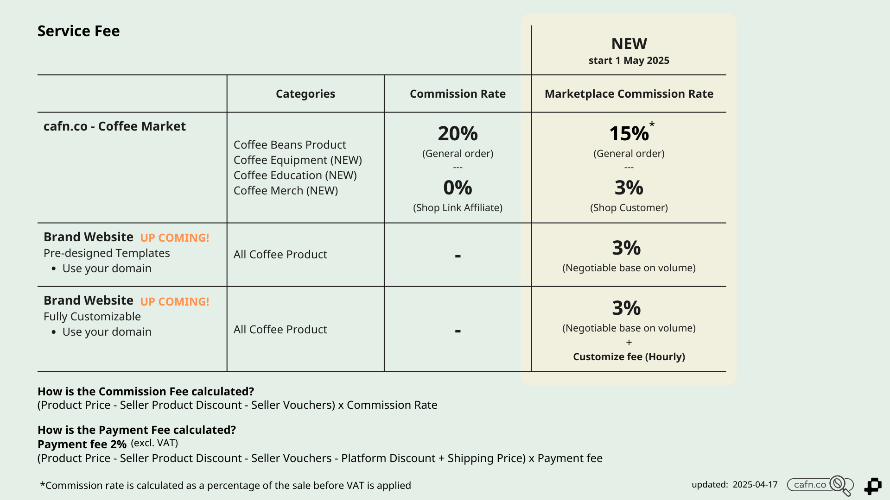

การคิดค่าบริการของการใช้ระบบ ประกอบด้วย 2 ส่วน ได้แก่
1. ค่าคอมมิชชันมาร์เก็ตเพลส (Marketplace Commission Fee)
2. ค่าธรรมเนียมการชำระเงิน (Payment fee)

## 1. ค่าคอมมิชชันมาร์เก็ตเพลส (Marketplace Commission Fee)
เปอร์เซนต์ค่าคอมมิชชันมาร์เก็ตเพลส จะคำนวณจากคำสั่งซื้อโดย **ขึ้นอยู่กับประเภทของคำสั่งซื้อ** ได้แก่
- **คำสั่งซื้อทั่วไป (General Order) อัตราค่าคอมมิชชัน 15%***
- **คำสั่งซื้อจากลูกค้าของร้านค้า (Shop Customer) อัตราค่าคอมมิชชัน 3%***
	- ลิงก์หน้าร้าน (Shop Link)
	- ลิงก์หน้าสินค้า (Product Link)
	- ลิงก์จากการค้นหาบนกูเกิล (Google-SEO)

### 1.1 คำสั่งซื้อทั่วไป (General Order)  
คำสั่งซื้อทั่วไป คือ คำสั่งซื้อที่เกิดจากลูกค้าที่ **เข้าสู่แพลตฟอร์มจากแพลตฟอร์มเอง** ดังนี้ 
- จากหน้าเว็บไซต์โดยตรง
- จากโปรแกรมการตลาดของแพลตฟอร์ม ได้แก่ โฆษณา การลดราคา SEO
- จากสื่อโซเชียลมีเดีย และคอนเทนต์ของแบรนด์แพลตฟอร์ม 

### 1.2 คำสั่งซื้อจากลูกค้าของร้านค้า (Shop Customer)
คำสั่งซื้อจากลูกค้าของร้านค้า คือ คำสั่งซื้อที่เกิดจากลูกค้าที่ **เข้าสู่แพลตฟอร์มจากร้านค้าเอง** โดยระบบจะจดจำลูกค้าคนดังกล่าว และติดสถานะ [Shop Customer Program (SC)](docs/marketing/sc-shop-customer-program/index.md) ของร้านค้า

ลูกค้าของร้านค้า หรือ Shop Customer จะมีการเข้าสู่แพลตฟอร์มผ่านลิงก์แบบต่าง ๆ รวมถึงการใช้ลิงก์ดังกล่าวในการสร้างโฆษณาเพื่อนำลูกค้าเข้าสู่แพลตฟอร์ม ดังนี้ 

#### 1.2.1 ลิงก์หน้าร้าน (Shop Link)
ลิงก์เข้าสู่หน้าร้านค้า ที่สร้างด้วยระบบสร้างลิงก์ สามารถคัดลอกลิงก์ดังกล่าวได้ที่ Seller Center

#### 1.2.2 ลิงก์หน้าสินค้า (Product Link)
ลิงก์เข้าสู่หน้าสินค้า ที่สร้างด้วยระบบสร้างลิงก์ สามารถคัดลอกลิงก์ดังกล่าวได้ที่ Seller Center

#### 1.2.3 ลิงก์จากการค้นหาบนกูเกิล (Google-SEO) 
ลิงก์เข้าสู่หน้าร้านค้า หรือ ลิงก์เข้าสู่หน้าสินค้า ที่ปรากฏบนหน้าการค้นหา Search Engine ซึ่งเกิดจาก SEO

#### 1.2.4 การโฆษณา (Ads)
เข้าสู่หน้าร้านค้าหรือสินค้า ผ่านโฆษณาที่ใช้ Link ข้อ 1 และ 2 เพื่อนำลูกค้าเข้าสู่แพลตฟอร์ม 

:::tip
**แนะนำการใช้งาน Shop Link และ Product Link**
- ใช้เป็นลิงก์ร้านค้าหลัก 
- วางใน Linktree หรือหน้ารวมลิงก์ร้านค้า
- ส่งให้ลูกค้าซื้อโดยตรง
- นำลิงก์ไปยิงโฆษณา
:::

 *อัตราค่าคอมมิชชั่นจะคำนวณจากเปอร์เซ็นต์ของยอดขายก่อนภาษีมูลค่าเพิ่ม (VAT)

---

## 2. ค่าธรรมเนียมการชำระเงิน (Payment Fee)
เปอร์เซนต์ค่าธรรมเนียมการชำระเงิน คือ ค่าบริการการชำระเงินจากลูกค้าผ่านแพลตฟอร์ม คำนวณจากคำสั่งซื้อโดยคิดเป็นอัตรา **2%*** 

**บริการชำระเงิน**
- QR code
- บัตรเครดิต (เร็ว ๆ นี้)
- PayPal (เร็ว ๆ นี้)

*อัตราค่าคอมมิชชั่นจะคำนวณจากเปอร์เซ็นต์ของยอดขายก่อนภาษีมูลค่าเพิ่ม (VAT)

---

## การคำนวณค่าคอมมิชชันมาร์เก็ตเพลส และค่าธรรมเนียมการชำระเงิน

### ค่าคอมมิชชันมาร์เก็ตเพลส คำนวณอย่างไร
**(ราคาสินค้า - ส่วนลดสินค้าจากร้านค้า - คูปองลดราคาจากร้านค้า) x อัตราค่าคอมมิชชันมาร์เก็ตเพลส**

**ตัวอย่าง** 
General Order ลูกค้าทั่วไป ซื้อสินค้าราคาเต็ม 1,000 บาท (ไม่มีส่วนลด) 
(1,000) x 15%
ค่าคอมมิชชันมาร์เก็ตเพลส = 150 บาท

Shop Customer ซื้อสินค้าราคาเต็ม 1,000 บาท (ไม่มีส่วนลด) 
(1,000) x 3% 
ค่าคอมมิชชันมาร์เก็ตเพลส = 30 บาท

Shop Customer ซื้อสินค้าราคา 1,000 บาท (สินค้ามีโปรลดราคา 10%, ใช้คูปองร้านค้าลด 50 บาท, ใช้คูปองแพลฟอร์มลด 50 บาท) 
(1,000-10%-50 ) x 3% 
ค่าคอมมิชชันมาร์เก็ตเพลส = 25.5 บาท

### ค่าธรรมเนียมการชำระเงิน คำนวณอย่างไร
**(ราคาสินค้า - ส่วนลดสินค้าจากร้านค้า - คูปองลดราคาจากร้านค้า - ส่วนลดแพลตฟอร์ม + ค่าส่ง) X อัตราค่าธรรมเนียมการชำระเงิน**

**ตัวอย่าง**

- ซื้อสินค้าราคาเต็ม 1,000 บาท (ไม่มีส่วนลด) 
- (1,000) x 2% 
- ค่าธรรมเนียมการชำระเงิน = 20 บาท 

ซื้อสินค้าราคา 1,000 บาท (สินค้ามีโปรลดราคา 10%, ใช้คูปองร้านค้าลด 50 บาท, ใช้คูปองแพลฟอร์มลด 50 บาท) 
(1,000-10%-50-50) x 2% 
ค่าคอมมิชชันมาร์เก็ตเพลส = 16 บาท 

----

## บริการแบรนด์เว็บไซต์ (Brand Website) - =เร็ว ๆ นี้=
แบรนด์เว็บไซต์ คือ การสร้างหน้าร้านออนไลน์หรือเว็บไซต์ของแบรนด์ โดยสามารถใช้โดเมนของแบรนด์เองได้ เช่น thegoodcoffee.com ร่วมกับการใช้ระบบหลังบ้านของเรา ได้แก่ ระบบริหารจัดการสินค้าและสต๊อก การแจ้งเตือนออเดอร์ การสร้างใบปะหน้าพัสดุและเรียกขนส่ง การเงิน   

**รูปแบบการให้บริการ**
1. เทมเพลตร้านค้า (Pre-designed Templates)
2. ปรับแต่งเต็มรูปแบบสำหรับแบรนด์ของคุณ (Fully Customizable)

** *สินค้าในกลุ่มกาแฟ สามารถเปิดขายสินค้าทั้ง cafn.co - Coffee Market และแบรนด์เว็บไซต์ ได้พร้อมกัน โดยใช้ระบบจัดการหลังบ้านเดียวกัน โดยไม่มีค่าใช้จ่ายเพิ่มเติม* 

### 1. เทมเพลตร้านค้า (Pre-designed Templates)
คือ การใช้รูปแบบหน้าเว็บไซต์ที่ออกแบบไว้ โดยปรับเปลี่ยนสีและรายละเอียดให้เข้ากับแบรนด์ได้บางส่วน

**ข้อดี**
- รวดเร็ว พร้อมใช้งาน
- ไม่มีค่าออกแบบ เพิ่มเติม
**ข้อเสีย**
- มีข้อจำกัดในการออกแบบ 

**อัตราค่าบริการ**
1. ค่าคอมมิชชันมาร์เก็ตเพลส (Marketplace Commission Fee)- 3%
2. ค่าธรรมเนียมการชำระเงิน (Payment fee)- 2%

**บริการเสริม** 
- บริการจัดซื้อโดเมน - ฟรี (ช่วงโปรโมชัน)

### 2. ปรับแต่งเต็มรูปแบบสำหรับแบรนด์ของคุณ (Fully Customizable)
คือ การสร้างหน้าเว็บไซต์ของแบรนด์เอง โดยสามารถออกแบบปรับแต่งได้เต็มรูปแบบ 

**ข้อดี**
- ออกแบบเว็บไซต์ซื้อขายของแบรนด์ได้ตามต้องการ
**ข้อเสีย**
- มีค่าบริการเพิ่มเติม
- ใช้ระยะเวลาในขั้นตอนการออกแบบ

**อัตราค่าบริการ**
1. ค่าคอมมิชชันมาร์เก็ตเพลส (Marketplace Commission Fee) - 3%
2. ค่าธรรมเนียมการชำระเงิน (Payment fee) - 2%
3. ค่าบริการออกแบบเว็บไซต์และเขียนโปรแกรม (Customize fee) - คิดค่าบริการรายชั่วโมง (เสนอราคาเพื่อพิจารณาตามสโคปงาน)

**บริการเสริม** 
- บริการจัดซื้อโดเมน - ฟรี (ช่วงโปรโมชัน)

---
อ่านเพิ่ม

[Shop Customer Program (SC)](docs/marketing/sc-shop-customer-program/index.md) 