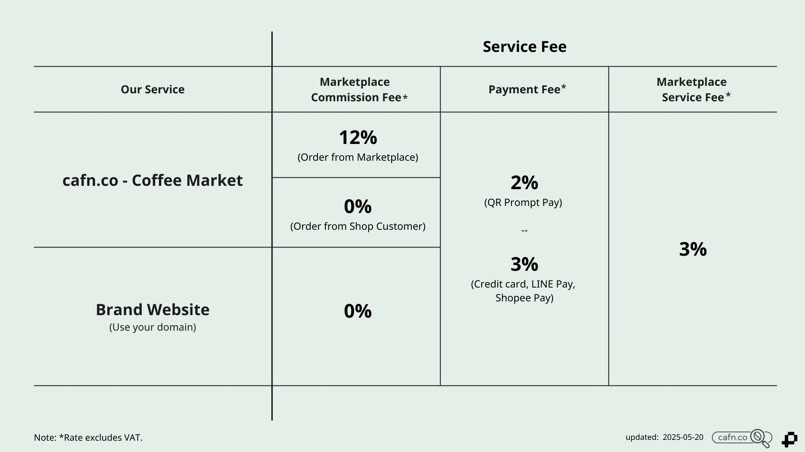
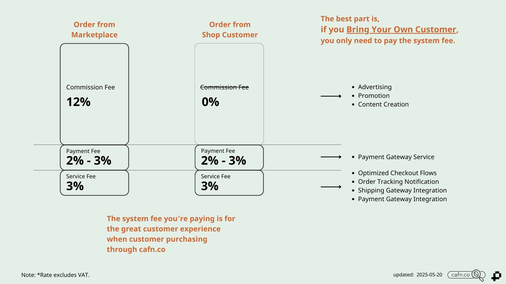

การคิดค่าบริการของการใช้ระบบ ประกอบด้วย 3 ส่วน ได้แก่

1. ค่าธรรมเนียมบริการมาร์เก็ตเพลส (Marketplace Service Fee) 
2. ค่าคอมมิชชันมาร์เก็ตเพลส (Marketplace Commission Fee)
3. ค่าธรรมเนียมการชำระเงิน (Payment Fee)

:::info
โปรแกรมคำนวณค่าธรรมเนียม > [**Service Fee Calculator**](/fees)
:::

## 1. ค่าธรรมเนียมบริการมาร์เก็ตเพลส (Marketplace Service Fee)

ค่าธรรมเนียมการบริการมาร์เก็ตเพลส คือ ค่าธรรมเนียมการใช้บริการระบบมาร์เก็ตเพลส คำนวณจากราคาสินค้าในแต่ละคำสั่งซื้อ

**มีอัตรา 3%*** ในทุกคำสั่งซื้อ

## 2. ค่าคอมมิชชันมาร์เก็ตเพลส (Marketplace Commission Fee)

ค่าคอมมิชชันมาร์เก็ตเพลส คือ ส่วนแบ่งการขายสินค้าบนมาร์เก็ตเพลส คำนวณจากราคาสินค้าในแต่ละคำสั่งซื้อ **ขึ้นอยู่กับประเภทของคำสั่งซื้อ** 

- **มีอัตรา 12%*** เฉพาะคำสั่งซื้อจากแพลตฟอร์ม (Order from Marketplace) 
- **มีอัตรา 0%*** เฉพาะคำสั่งซื้อจากร้านค้า (Order from Shop Customer)  *อ่านเพิ่ม* [*SC-Shop Customer*](docs/marketing/sc-shop-customer-program/index.md)
  

### 2.1 คำสั่งซื้อจากแพลตฟอร์ม (Order from Marketplace) 

คำสั่งซื้อจากแพลตฟอร์ม คือ คำสั่งซื้อที่เกิดจากลูกค้าที่ **เข้าสู่แพลตฟอร์มจากแพลตฟอร์ม** ดังนี้

- จากหน้าเว็บไซต์โดยตรง
- จากโปรแกรมการตลาดของแพลตฟอร์ม ได้แก่ โฆษณา การลดราคา SEO
- จากสื่อโซเชียลมีเดีย และคอนเทนต์ของแบรนด์แพลตฟอร์ม

### 2.2 คำสั่งซื้อจากร้านค้า (Order from Shop Customer)

คำสั่งซื้อจากร้านค้า คือ คำสั่งซื้อที่เกิดจากลูกค้าที่ **เข้าสู่แพลตฟอร์มจากลิงก์ร้านค้า** โดยระบบจะจดจำลูกค้าคนดังกล่าว และติดสถานะ [Shop Customer (SC)](docs/marketing/sc-shop-customer-program/index.md) ของร้านค้า

Shop Customer จะมีการเข้าสู่แพลตฟอร์มผ่านลิงก์แบบต่าง ๆ รวมถึงการใช้ลิงก์ดังกล่าวในการสร้างโฆษณาเพื่อนำลูกค้าเข้าสู่แพลตฟอร์ม ดังนี้

- ลิงก์หน้าร้าน (Shop Link) หรือ ลิงก์หน้าสินค้า (Product Link)
- จากการค้นหาบนกูเกิล (Google-SEO)
- การโฆษณาด้วยลิงก์หน้าร้านและหน้าสินค้า (Ads)

:::tip
**แนะนำการใช้งาน Shop Link และ Product Link**

- ใช้เป็นลิงก์ร้านค้าหลัก
- วางในหน้ารวมลิงก์ร้านค้า
- ส่งให้ลูกค้าซื้อโดยตรง
- นำลิงก์ไปยิงโฆษณา

  :::

---

## 3. ค่าธรรมเนียมการชำระเงิน (Payment Fee)

ค่าธรรมเนียมการชำระเงิน คือ ค่าบริการการชำระเงินจากลูกค้าของร้านค้าผ่านแพลตฟอร์ม คำนวณจากยอดที่ลูกค้าของร้านจ่าย **ขึ้นอยู่กับรูปแบบการชำระเงิน**

- QR PromptPay: **มีอัตรา 2%***
- บัตรเครดิต (เร็ว ๆ นี้): **มีอัตรา 3%***
- LINE Pay (เร็ว ๆ นี้): **มีอัตรา 3%***
- Shopee Pay (เร็ว ๆ นี้): **มีอัตรา 3%***
- PayPal (เร็ว ๆ นี้) 

---

*หมายเหตุ: *อัตราดังกล่าวยังไม่รวมภาษีมูลค่าเพิ่ม (VAT 7%)

---

## บริการแบรนด์เว็บไซต์ (Brand Website) - =เร็ว ๆ นี้=

แบรนด์เว็บไซต์ คือ การสร้างหน้าร้านออนไลน์หรือเว็บไซต์ของแบรนด์ โดยสามารถใช้โดเมนของแบรนด์เองได้ เช่น thegoodcoffee.com ร่วมกับการใช้ระบบหลังบ้านของเรา ได้แก่ ระบบริหารจัดการสินค้าและสต๊อก การแจ้งเตือนออเดอร์ การสร้างใบปะหน้าพัสดุและเรียกขนส่ง การเงิน

**รูปแบบการให้บริการ**

1. เทมเพลตร้านค้า (Pre-designed Templates)
2. ปรับแต่งเต็มรูปแบบสำหรับแบรนด์ของคุณ (Fully Customizable)

\*\* _สินค้าในกลุ่มกาแฟ สามารถเปิดขายสินค้าทั้ง cafn.co - Coffee Market และแบรนด์เว็บไซต์ ได้พร้อมกัน โดยใช้ระบบจัดการหลังบ้านเดียวกัน โดยไม่มีค่าใช้จ่ายเพิ่มเติม_

### 1. เทมเพลตร้านค้า (Pre-designed Templates)

คือ การใช้รูปแบบหน้าเว็บไซต์ที่ออกแบบไว้ โดยปรับเปลี่ยนสีและรายละเอียดให้เข้ากับแบรนด์ได้บางส่วน

**ข้อดี**

- รวดเร็ว พร้อมใช้งาน
- ไม่มีค่าออกแบบ เพิ่มเติม

**ข้อเสีย**

- มีข้อจำกัดในการออกแบบ

**อัตราค่าบริการ**

1. ค่าธรรมเนียมบริการมาร์เก็ตเพลส (Marketplace Service Fee) - 3%
2. ค่าธรรมเนียมการชำระเงิน (Payment Fee) - เริ่มต้น 2% ขึ้นอยู่กับรูปแบบการชำระเงิน

**บริการเสริม**

- บริการจัดซื้อโดเมน - ฟรี (ช่วงโปรโมชัน)

### 2. ปรับแต่งเต็มรูปแบบสำหรับแบรนด์ของคุณ (Fully Customizable)

คือ การสร้างหน้าเว็บไซต์ของแบรนด์เอง โดยสามารถออกแบบปรับแต่งได้เต็มรูปแบบ

**ข้อดี**

- ออกแบบเว็บไซต์ซื้อขายของแบรนด์ได้ตามต้องการ

**ข้อเสีย**

- มีค่าบริการเพิ่มเติม
- ใช้ระยะเวลาในขั้นตอนการออกแบบ

**อัตราค่าบริการ**

1. ค่าธรรมเนียมบริการมาร์เก็ตเพลส (Marketplace Service Fee) - 3%
2. ค่าธรรมเนียมการชำระเงิน (Payment Fee) - เริ่มต้น 2% ขึ้นอยู่กับรูปแบบการชำระเงิน
3. ค่าบริการออกแบบเว็บไซต์และเขียนโปรแกรม (Customize Fee) - คิดค่าบริการรายชั่วโมง (เสนอราคาเพื่อพิจารณาตามสโคปงาน)

**บริการเสริม**

- บริการจัดซื้อโดเมน - ฟรี (ช่วงโปรโมชัน)

---

อ่านเพิ่ม

[Shop Customer Program (SC)](docs/marketing/sc-shop-customer-program/index.md)
