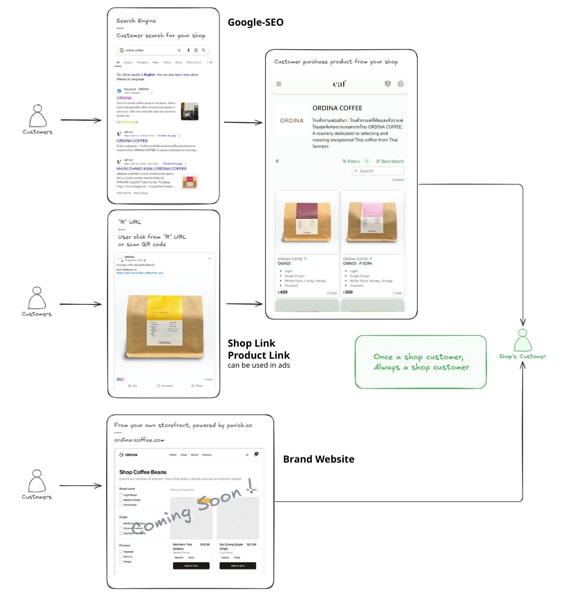

:::info
[Service Fee Calculator](/fees)
:::

## Shop Customer Program

คือ **โปรแกรมการขายแบบค่าคอมมิชชันต่ำ** เกิดจากคำสั่งซื้อของลูกค้า ที่มีสถานะ Shop Customer ของร้านนั้น

ลูกค้าจะมีสถานะ Shop Customer ของร้าน จากการเข้าสู่แพลตฟอร์มในรูปแบบดังนี้

## 1 ลิงก์หน้าร้าน (Shop Link)

ลิงก์เข้าสู่หน้าร้านค้า ที่สร้างด้วยระบบสร้างลิงก์ สามารถคัดลอกลิงก์ดังกล่าวได้ที่ Seller Center หรือ คัดลอกลิงก์ของร้านจากเว็บบราวเซอร์ เปลี่ยนจาก "shop" เป็น "r"

**ตัวอย่าง** 
https://cafn.co/shop/123coffeeroaster เปลี่ยนเป็น https://cafn.co/r/123coffeeroaster

## 2 ลิงก์หน้าสินค้า (Product Link)

ลิงก์เข้าสู่หน้าสินค้า ที่สร้างด้วยระบบสร้างลิงก์ สามารถคัดลอกลิงก์ดังกล่าวได้ที่ Seller Center หรือ คัดลอกลิงก์หน้าสินค้าจากเว็บบราวเซอร์ เปลี่ยนจาก "shop" เป็น "r"

**ตัวอย่าง** 
https://cafn.co/shop/123coffeeroaster/acb-blend01 เปลี่ยนเป็น https://cafn.co/r/123coffeeroaster/acb-blend01

## 3 การค้นหาบนกูเกิล (Google-SEO)

เข้าสู่หน้าร้านค้า หรือ หน้าสินค้า จากหน้าการค้นหา Google Search Engine ซึ่งเกิดจากระบบ SEO

## 4 การโฆษณา (Ads)

การโฆษณาที่ใช้ Link ข้อ 1 และ 2 เพื่อนำลูกค้าเข้าสู่แพลตฟอร์ม

## Q&A

SC = Shop Customer

> Q : ลูกค้าเป็น SC ของร้านอื่นไปแล้ว

> A : ลูกค้า 1 คน สามารถมีสถานะเป็น Shop Customer ของร้านค้าหลายร้าน

--

> Q : ลูกค้ากดลิงก์ร้านเราเข้ามา แต่ไม่ซื้อ

> A : ลูกค้าจะยังไม่มีสถานะ SC จนกว่าจะเกิดการซื้อ โดยระบบจะเก็บ cookie ไว้ 5 วัน หากเกิดการซื้อสินค้าในระยะเวลาดังกล่าว ลูกค้าจะติดสถานะ SC ของร้านเรา

--

> Q : ลูกค้ากดลิงก์ร้านเราเข้ามา แต่ไปซื้อร้านอื่น

> A : หากเข้ามาจากลิงก์ต้นทางของร้านเรา แม้จะซื้อสินค้าร้านอื่น ลูกค้าจะมีสถานะ SC ของร้านเราเท่านั้น

--

> Q : จะรู้ได้อย่างไร ว่าร้านเรามี SC กี่คน และมีกี่ออเดอร์จาก SC

> A : มีการสรุปจำนวน และยอดขาย แยกระหว่าง ออเดอร์ทั่วไป และ ออเดอร์จาก SC ระบบเริ่มเก็บข้อมูลแล้ว แต่การแสดงผลยังอยู่ในระหว่างกระบวนการ

## Recommendations

**แนะนำการใช้งาน Shop Link และ Product Link**

- ใช้เป็นลิงก์ร้านค้าหลัก
- วางใน Linktree หรือหน้ารวมลิงก์ร้านค้า
- ส่งให้ลูกค้าซื้อโดยตรง
- นำลิงก์ไปยิงโฆษณา
