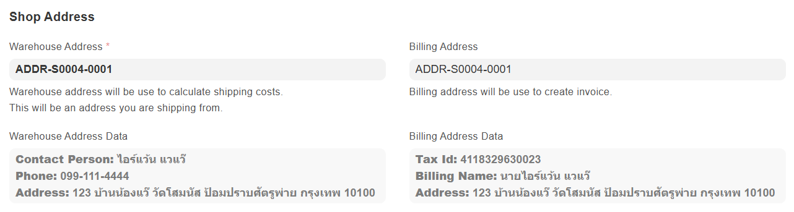

ที่อยู่คลังสินค้า ประกอบด้วย ชื่อ ที่อยู่ เบอร์มือถือ ใช้สำหรับ 
- ระบุบนพัสดุ 
- ตีกลับพัสดุหากไม่สามารถนำส่งได้สำเร็จ
- การเข้ารับพัสดุ (pick up)
- คำนวณค่าขนส่ง

## การเพิ่มที่อยู่ร้านค้า

- เข้าสู่ [Seller Center](https://office.panich.co) > ล็อกอินด้วยบัญชีร้านค้าของคุณ 
- เลือก Setting > เลือก Shop > เลือก ร้านค้า
- ไปที่หัวข้อ **Shop Address**
- ที่ช่อง **Warehouse Address** > เลือก Create a new Thai address
- เพิ่มรายละเอียดต่าง ๆ  > เลือก Save

หากใช้ที่อยู่เดียวกันสำหรับออกใบเสร็จ/ใบกำกับภาษา 
- เลือก Is Billing Address > เพิ่มรายละเอียดชื่อ สาขา เลขประจำตัวผู้เสียภาษี  > เลือก Save

กลับไปที่หน้าร้าน Shop ที่หัวข้อ **Shop Address** ตรวจสอบว่า Warehouse Address และ Billing Address (ถ้ามี) ถูกเพิ่มในระบบ และถูกเลือกอยู่ > Save

รายละเอียดที่อยู่จะถูกแสดงให้เห็น

:::warning
การระบุที่อยู่คลังสินค้าไม่ถูกต้อง อาจทำให้ระบบไม่สามารถคำนวณค่าส่งได้ ส่งผลให้ลูกค้าไม่สามารถสั่งซื้อสินค้าได้
:::